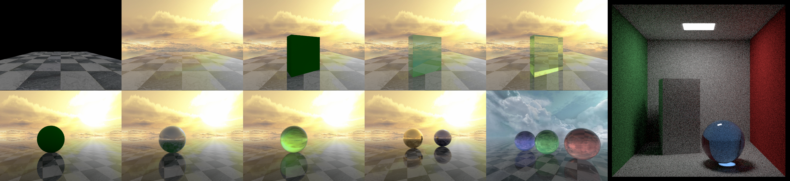

<div align=center>
  <h1>
    Ray Tracing
  </h1>
  <p>
    <a href=https://mhsung.github.io/kaist-cs580-spring-2024/ target="_blank"><b>KAIST CS580: Computer Graphics</b></a><br>
    Programming Assignment    
  </p>
</div>

<div align=center>
  <p>
    Instructor: <a href=https://mhsung.github.io target="_blank"><b>Minhyuk Sung</b></a> (mhsung [at] kaist.ac.kr)<br>
    TA: <a href=https://dvelopery0115.github.io target="_blank"><b>Seungwoo Yoo</b></a>  (dreamy1534 [at] kaist.ac.kr)      
  </p>
</div>

<div align=center>
  
</div>

#### Due: April 7, 2024 (Sunday) 23:59 KST
#### Where to Submit: Gradescope

## Abstract

In this programming assignment, you will implement a minimal ray tracer to gain deeper understanding of light transport simulation. This assignment focuses on comprehending core concepts of ray tracing, including ray generation, ray-object intersection, the rendering equation, and materials, while avoiding the use of complex techniques (e.g., spatial trees) necessary for scalability. This assignment can be done purely in Python using basic libraries (e.g., NumPy, Pillow).

This assignment is heavily based on the [Python-Raytracer](https://github.com/rafael-fuente/Python-Raytracer) by [Rafael Fuente](https://github.com/rafael-fuente). You may refer to the repository while working on the tasks below. **However, it is strictly forbidden to simply copy, reformat, or refactor the necessary codeblocks when making your submission. You must implement the functionalities on your own with clear understanding of how your code works. As noted in [Grading](#grading), we will detect such cases with a specialized tool and plagiarism in any form will result in a zero score.**

<details>
<summary><b>Table of Content</b></summary>

- [Abstract](#abstract)
- [Setup](#setup)
- [Tasks](#tasks)
    - [Task 0. Ray Generation](#0-ray-generation)
    - [Task 1. Ray-Object Intersection](#1-ray-object-intersection)
    - [Task 2. The Rendering Equation](#2-the-rendering-equation)
    - [Task 3. Materials](#3-materials)
- [What to Submit](#what-to-submit)
- [Grading](#grading)
</details>

## Setup

1. Clone this repository and navigate to the directory.
```
git clone https://github.com/KAIST-Visual-AI-Group/CS580-Assignment
cd CS580-Assignment
```
2. Make a private fork of this repository. To do so, first create a private repository on [GitHub](https://github.com) and proceed the following.
```
git remote rename origin sourcerepo
git remote add origin {URL of your private repository}
git push -u origin main
```
3. Create `conda` environment containing all necessary packages and activate the environment.
```
conda env create -f environment.yml
conda activate cs580-rt
```
4. Check if the environment is properly set up by running the main script. The script should crash with `NotImplementedError` since its main functionalities are not implemented yet.
```
python main.py --scene-type {"scene0"|"scene0-skybox"|"scene1-diffuse"|"scene1-glossy"|"scene1-refractive"|"scene2-diffuse"|"scene2-glossy"|"scene2-refractive"|"scene3"|"scene4"|"cornell_box"}
```

## Tasks

### 0. Ray Generation

To start tracing rays, we must cast them from the camera through the pixels. Implement function `get_ray` in `src/camera.py` to generate rays from the camera to each pixel on the image plane.

### 1. Ray-Object Intersection

Geometric queries, such as determining whether a ray intersects with an object in the scene, are necessary for light transport simulation. Implement the method `intersect` of the classes `Plane_Collider`, `Cuboid_Collider`, `Sphere_Collider` in `src/geometry/plane.py`, `src/geometry/cuboid.py` and `src/geometry/sphere.py`. These methods should return the NumPy array containing the ray distance to the intersection points and the surface orientation at the points. Refer to the same method in `src/geometry/triangle.py` for the data convention.

> :bulb: **Note that cuboids are used to implement sky boxes that serve as environmental lighting. That is, your implementation should correctly handle the case where ray origins lie inside cuboids.**

### 2. The Rendering Equation

What is particularly interesting about the rendering equation is that its solution requires recursive evaluation to estimate the total radiance contribution of rays. Implement the function `get_raycolor` in `src/ray.py`, which is the central part of our ray tracer. This function computes the color contribution of a ray by performing a ray-object intersection check and initiating recursive ray tracing for reflection and refraction, depending on the material characteristic of the surface.

### 3. Materials

Materials play a crucial role in ray tracing as they simulate how light interacts with surfaces. Implement the method `get_color` of the classes `Diffuse`, `Glossy`, and `Refractive` defined in `src/materials/diffuse.py`, `src/materials/glossy.py`, and `src/materials/refractive.py`, respectively. We recommend you to start with the `Glossy` material, since our first scene (`scene0`) only consists of objects with glossy materials. Other materials will be incrementally added in other test scenes to help you debug your implementation.

## What to Submit

After completing the tasks, render 11 scenes defined in `main.py` by executing the script `render_all.sh`. The images will be stored under the directory `outputs` by default. As mentioned, the scenes are ordered by their complexity to help you debug your implementation. Try the simplest scene first and move on to the next.

Compile the entire project directory, including the `outputs` directory, as a **ZIP** file named `{NAME}_{STUDENT_ID}.zip` and submit the file via Gradescope.

> :warning: **The images are necessary for grading. That is, the ZIP file must contain the `outputs` directory containing the rendered images. Please double-check your submission before the deadline.**

> :warning: **The submitted results must be reproducible with the submitted code.**

## Grading

**You will receive a zero score if:**
- **you do not submit,**
- **your code is not executable in the Python environment we provided, or**
- **you modify any code outside of the section marked with `TODO`.**

**Plagiarism in any form will also result in a zero score and will be reported to the university.**

> :warning: **We will run a specialized detection software to check for plagiarism. Do not neither refer to existing codebase(s) nor share your code with others.**

Each example scene is assigned 8 points, except for the scene `cornell_box` which is worth 20 points. Thus, the full credit for this assignment is 100 (8 x 10 + 20) points and will be counted toward your final grade. Your implementation will be graded qualitatively. That is, you will receive full credit unless your images are completely black or contain obvious artifacts.
